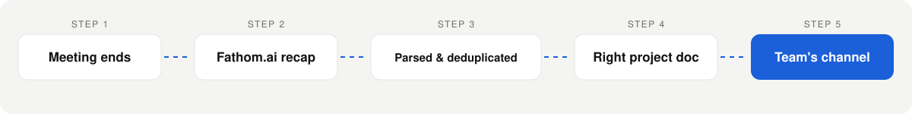

  
  
  
  

 

 

## Selected work

Five products, each with the decisions that shaped them, including the ones that cost something.

| | Product | The problem | What shipped |
|:--|:--|:--|:--|
| **01** | **Field Operations Platform** Commercial HVAC · Canada | An owner who couldn't be on every roof. | Four client goals delivered as one product in **8 sprints**. |
| **02** | **Health Platform** Digital health · Canada | A clinic on paper and WhatsApp. | One owned platform across **3 milestones**, cleared through app review as a regulated health product. |
| **03** | **Concurrent Delivery** AI & digital platforms · Malaysia | Four products, one client, running in parallel. | Priorities, dependencies and stakeholders across all **4** of them. |
| **04** | **School Management SaaS** EdTech | Schools running on paper registers. | Concept to paying customers across **25 sprints**, and what I learned when it was wound down. |
| **05** | **People Function** Built from zero | First HR hire during a 5x growth period. | **8 to 45+** people in 18 months, and the systems that made it hold. |

<a href="https://ghazalabaraki.github.io/"><b>Read the deep dives →</b></a>

## How I work

The same five moves, whether it's a Canadian health platform or a company's first HR handbook.

  
  →
  
  →
  
  →
  
  →
  

> Clients don't arrive with requirements. They arrive with a problem, phrased as a frustration. Turning that into something a team can build is the job.

## I automate my own job

Status reporting is the tax every project manager pays. I stopped paying it.

Manual logging and reporting, eliminated across 10+ weekly meetings, along with the gap between what was said in a meeting and what got written down.

## What I picked up, and when

| When | Stage | What it added |
|:--|:--|:--|
| 2022 | **People first** | Cross functional leadership · Mentoring · Onboarding · Hiring at volume |
| 2022 to 2024 | **Then systems** | SOPs from scratch · Handbooks · Process optimisation · Dashboards |
| 2024 to 2026 | **Then delivery** | Scrum & Kanban · Roadmapping · Risk & dependencies · QA and release gates |
| Now | **Building with AI** | AI prototyping · n8n · Zapier · Google Apps Script · Fathom.ai recaps |

## The tools I know cold

## What people say

> "Clarity, composure, and a sharp understanding of both product and people."
>  **Imam Faheem** · Senior Software Engineer & Architect

> "Knows how to bring people together, gaining support from stakeholders to keep projects moving forward."
>  **Bilal Wahab** · UX/UI Designer

## The record

**MS Project Management**, IM|Sciences · **BS Information Technology** · Google Project Management Certificate · IBM Product Management track · Agile with Atlassian Jira · ClickUp Expert · Amal Career Prep Fellowship

Pashto · Urdu · English · Persian

 

  <b>Remote, and used to it.</b> Two years running delivery across Canada, Malaysia and Pakistan. 
  Pakistan · GMT+5  
  <a href="mailto:ghazalabaraki@gmail.com"><b>Let's talk →</b></a>

